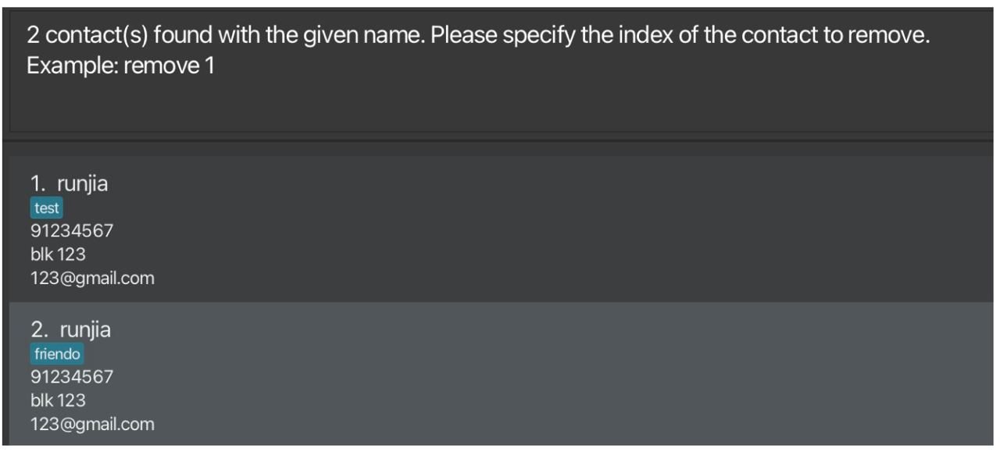
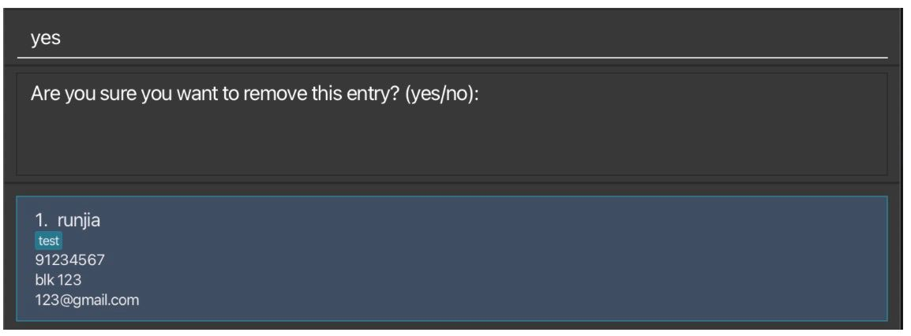
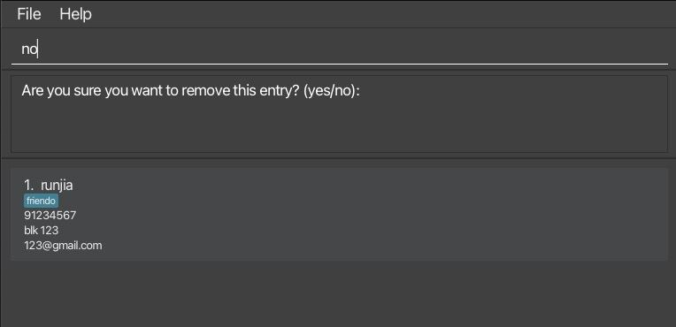

# LookMeUp User Guide

Welcome to LookMeUp, your one-stop desktop app that revolutionizes contacts management for NUS students in hall committees. Liking the speed and effectiveness of Command Line Interface (CLI) or visual simplicity of Graphical User Interface (GUI)? LookMeUp caters to your needs, it ensures that managing your contacts is quicker and more efficient than ever before.

So say goodbye to traditional address book applications and say hello to the future of contact management with LookMeUp!

<!-- * Table of Contents -->
<page-nav-print />

--------------------------------------------------------------------------------------------------------------------

## Quick start

1. Ensure you have Java `11` or above installed in your Computer.

1. Download the latest `LookMeUp.jar` from [here](https://github.com/AY2324S2-CS2103T-T12-2/tp/releases/tag/v1.3(final)).

1. Copy the file to the folder you want to use as the _home folder_ for your AddressBook.

1. Open a command terminal, `cd` into the folder you put the jar file in, and use the `java -jar LookMeUp.jar` command to run the application. 
   A GUI similar to the below should appear in a few seconds. Note how the app contains some sample data. 
   

1. Type the command in the command box and press Enter to execute it. e.g. typing **`help`** and pressing Enter will open the help window. 

1. Refer to the [Command Summary](#command-summary) below for details of each command.

--------------------------------------------------------------------------------------------------------------------

## Features

<box type="info" seamless>

**Syntax of Commands:** 

* Words in `UPPER_CASE` are the parameters to be supplied by the user. 
  e.g. in `add n/NAME`, `NAME` is a parameter which can be used as `add n/John Doe`.

* Items in square brackets are optional. 
  e.g `n/NAME [t/TAG]` can be used as `n/John Doe t/friend` or as `n/John Doe`.

* Items with `…`​ after them can be used multiple times including zero times. 
  e.g. `[t/TAG]…​` can be used as ` ` (i.e. 0 times), `t/friend`, `t/friend t/family` etc.

* Parameters can be in any order. 
  e.g. if the command specifies `n/NAME p/PHONE_NUMBER`, `p/PHONE_NUMBER n/NAME` is also acceptable.

* Extraneous parameters for commands that do not take in parameters (such as `help`, `list`, `exit` and `clear`) will be ignored. 
  e.g. if the command specifies `help 123`, it will be interpreted as `help`.

* If you are using a PDF version of this document, be careful when copying and pasting commands that span multiple lines as space characters surrounding line-breaks may be omitted when copied over to the application.
</box>

> [!TIP]
> * LookMeUp supports **fuzzy input** with a maximum allowance of 1 misspelled letter,
    preventing users from needing to retype the entire command due to a single spelling mistake.
  >   * Examples:
  >     * `swot` will be interpreted as `sort`
>     * `addystep` will be interpreted as `addbystep`
> * LookMeUp text field supports **command history** accessibility.
    >   * You can make use of your `Up` and `Down` arrow keys to navigate through the commands that you have previously entered.

> [! WARNING]
> Command prefixes (n/…​ a/…​ p/…​ e/…​ t/…​) only accepts lower case characters.
>   * Examples like N/…​ A/…​ P/…​ E/…​ T/…​ where prefixes are capital letters will not be accepted.

### Viewing help : `help`

Shows a message explaining how to access the help page.

Format: `help`

### Adding a person (Full Command): `add`

Adds a person to the address book.

Format: `add n/NAME p/PHONE_NUMBER e/EMAIL a/ADDRESS [t/TAG]…​`

> [!TIP]
> 
> * A person can have any number of tags **(including 0)**.
> 
> * There are no character limit restrictions for each input.
>   * However, it is advisable to keep each field under **100 characters** to ensure compatibility with your device's resolution.

> [!IMPORTANT]
>
> * Phone numbers should only contain numbers **(min 3 numbers)**.
> 
> * Name, address, email and tag inputs only support **alphanumeric characters** (with email accepting a single `@`).
>   * LookMeUp does not support non-alphanumeric characters. 
>   * LookMeUp does not support spacing for the input entered.

Examples:
* `add n/John Doe p/98765432 e/johnd@example.com a/John street, block 123, #01-01`
* `add n/Betsy Crowe t/friend e/betsycrowe@example.com a/Newgate Prison p/1234567 t/criminal`

### Adding a person (With System Prompts): `addbystep`

Adds a person to the address book but prompts will be provided for each field required as per the `add` command.

Format: `addbystep`

> [!NOTE]
> * If you enter `addbystep` with any additional parameters, _e.g. `addbystep 123`_, the additional parameters will be ignored,
and `addbystep` window will still launch as per normal.
> * Once you have added all the details, you have to close the window and retype the command to create a `add` command
> * Since this is an accessory window, **maximising of the window is not supported**.

### Listing all persons : `list`

Shows a list of all persons in the address book.

Format: `list`

### Editing a person : `edit`

Edits an existing person in the address book.

Format: `edit INDEX [n/NAME] [p/PHONE] [e/EMAIL] [a/ADDRESS] [t/TAG]…​`

* Edits the person at the specified `INDEX`. The index refers to the index number shown in the displayed person list. The index **must be a positive integer** 1, 2, 3, …​
* At least one of the optional fields must be provided.
* Existing values will be updated to the input values.
* When editing tags, the existing tags of the person will be removed i.e adding of tags is not cumulative.
* You can remove all the person’s tags by typing `t/` without
    specifying any tags after it.

Examples:
*  `edit 1 p/91234567 e/johndoe@example.com` Edits the phone number and email address of the 1st person to be `91234567` and `johndoe@example.com` respectively.
*  `edit 2 n/Betsy Crower t/` Edits the name of the 2nd person to be `Betsy Crower` and clears all existing tags.

> [! NOTE]
> 
> Editing a contact with the same value will still be considered a successful edit, and LookMeUp will prompt a "successful" message.
> 
> LookMeUp will display the entire contact fields in the "successful" message (shown below).
> 
> 

### Locating persons by name: `find`

Finds persons whose names contain any of the given keywords.

Format: `find KEYWORD [MORE_KEYWORDS]`

* The search is case-insensitive. e.g `hans` will match `Hans`
* The order of the keywords does not matter. e.g. `Hans Bo` will match `Bo Hans`
* Only the name is searched.
* Only full words will be matched e.g. `Han` will not match `Hans`
* Persons matching at least one keyword will be returned (i.e. `OR` search).
  e.g. `Hans Bo` will return `Hans Gruber`, `Bo Yang`

Examples:
* `find John` returns `john` and `John Doe`
* `find alex david` returns `Alex Yeoh`, `David Li` 
  

### Removing a person (With safe removal): `remove`

Removes a person based on name, and confirms with the corresponding index in the filtered name list.

Format in 3 steps:

1. **Optional**: `remove NAME`
   *  By using the name of the contact to delete 
        
     * LookMeUp will return matching contact names in a `filtered list`.
     * LookMeUp will prompt user a specified `INDEX` to remove. 
        
2. `remove INDEX` 
    
   * Removes the person in the filtered results by the specified index.
   * The `INDEX` refers to the index number shown in the displayed person list.
   * The index must be a `positive integer` 1, 2, 3, …​
   * If **STEP 1** was skipped. the contact at the specified index based on the default list of all contacts will be retrieved
     * LookMeUp will prompt a confirmation message to confirm removal
4. Confirmation: `yes/no` 
    
   1. If `yes`: 
       
       
   2. If `no`: 
       
       

### Undo Previous Command : `undo`

For any command that changes the universal list of contacts _e.g. `add`, `remove`, `clear`, `overwrite`, `duplicate` and `edit`_,
the `undo` command will revert the state of the contact list prior to the execution of a command. 

> [!NOTE]
> LookMeUp supports up to 3 consecutive `undo`
>   * You are able to backtrack your actions up to 3 times. 

Format: `undo`
For example, referring to the previous command, assuming you have `removed` a contact, you can type `undo` to recover the removed contact: 
 

The removed contact will then be restored, **even to its original index**. 
 

Similarly, `undoing` after adding a contact would mean reverting the contact list's state back to before the contact was added.

> [!IMPORTANT]
> Once you closed the application, all your changes will be saved and all your past command history will be **erased**.
>   * That is, when you launch the app again, you will not be able to undo any commands from the previous time you launched it.

###  Redo Undid Command : `redo`

Redo the most recent `undo` command.

Format: `redo`

For example, entering `redo` after previous `undo` example will revert the contacts to before `undo` was being executed.

> [!IMPORTANT]
> `redo` only works when `undo` was called.
> If there were no commands undone, entering `redo` will prompt an **error**.

### Copies a Person Information to Clipboard : `copy`

Copies a person’s information such as name, phone number, address and email into your OS clipboard. 
This feature allows you to copy **more than one** piece of a contact’s information, and allows you to specify the order of a person’s information to be copied. 
If multiple fields are provided, results are separated by a single whitespace.

> [!NOTE]
> Duplicated fields that are specified are safely process and copied 
> * Refer to the table below 

Format: `copy INDEX FIELD(s)`

Example: 
 

Based on the sample contact above:

| Sample Commands       | Details                                                                    | Results                  |
|-----------------------|----------------------------------------------------------------------------|--------------------------|
| `copy 4 name`         | Copies the name of contact indexed 4                                       | `Bert`                   |
| `copy 4 name address` | Copies the name and address of contact indexed 4                           | `Bert Sesame Street`     |
| `copy 4 phone email`  | Copies the phone and email of contact indexed 4                            | `88891234 Bert@gmail.com` |
| `copy 4 email email`  | Copies the email of contact indexed 4  **(Duplicated fields are ignored)** | `Bert@gmail.com`         |
| `copy 4 nnamee phone` | Incorrect field detected                                                   | `N.A.`                   |

### Sorting the Contacts : `sort`

Sorts the entries in the address book based on the given condition.

Format: `sort KEYWORD`

* LookMeUp supports the following `KEYWORDs` : `name`, `tag`
    * `Name`: Sorts the entries based on lexicographical order of names.
    * `Tag`: Sorts the entries based on lexicographical order of tags.

> [!IMPORTANT]
> * `Fuzzy input` does not support `KEYWORD`
    >   * e.g. `sort NAMEE` will result in an error.
> * Only **1 keyword** can be entered after `sort`
    >   * e.g. `sort NAME OTHERS` will result in an error.

> [! NOTE]
> When `sort tag` is executed, LookMeUp sorts tags by 
> **numbering**, followed by contacts **without tags**, and finally **alphabetically**
> 
>     

### Filtering by Tag : `filter`

Shows a list of persons in the address book, filtered by `specified tag`.

Format: `filter TAGNAME`

### Adding a Contact with Duplicate Identity : `duplicate`

Adds the new contact to the address book, **assuming that a contact with an identical identity already exists**.

Format: `duplicate n/NAME p/PHONE_NUMBER e/EMAIL a/ADDRESS [t/TAG]…​`

Example:
Say you have a list of contacts like the following, and you wish to add a contact with an **identical name** to the first entry `Alex Yeoh` 
 

You will encounter the following error using the `add` command 
 

To duplicate the contact, run the following `duplicate` command and enter to see the results. 
 
 

### Overwriting an Existing Contact : `overwrite`

Overwrites an existing contact in the address book, provided that a contact with an identical identity already exists in the address book.

Format: `overwrite INDEX n/NAME p/PHONE_NUMBER e/EMAIL a/ADDRESS [t/TAG]…​`
* `INDEX` refers to the index number shown in the displayed person list, that represents the target contact to be overwrite.
* The index **must be positive integer** 1, 2, 3, …​

### Clearing all entries : `clear`

Clears all entries from the address book.

Format: `clear`

### Exiting the program : `exit`

A pop-up would be shown that prompts you for **confirmation** to exit the address book.

Format: `exit`

### Saving the data

AddressBook data are saved in the hard disk automatically after any command that changes the data. There is no need to save manually.

### Editing the data file

AddressBook data are saved automatically as a JSON file `[JAR file location]/data/addressbook.json`. Advanced users are welcome to update data directly by editing that data file.

<box type="warning" seamless>

**Caution:**
If your changes to the data file makes its format invalid, AddressBook will discard all data and start with an empty data file at the next run.  Hence, it is recommended to take a backup of the file before editing it. 
Furthermore, certain edits can cause the AddressBook to behave in unexpected ways (e.g., if a value entered is outside the acceptable range). Therefore, edit the data file only if you are confident that you can update it correctly.
</box>

--------------------------------------------------------------------------------------------------------------------

## FAQ

**Q**: How do I transfer my data to another Computer? 
**A**: Install the app in the other computer and overwrite the empty data file it creates with the file that contains the data of your previous AddressBook home folder.

--------------------------------------------------------------------------------------------------------------------

## Known issues

1. **When using multiple screens**, if you move the application to a secondary screen, and later switch to using only the primary screen, the GUI will open off-screen. The remedy is to delete the `preferences.json` file created by the application before running the application again.

--------------------------------------------------------------------------------------------------------------------

## Command summary

| Command                                        | Details                                                                                                                                                                                                                                  |
|------------------------------------------------|------------------------------------------------------------------------------------------------------------------------------------------------------------------------------------------------------------------------------------------|
| `list`                                         | List all contacts                                                                                                                                                                                                                        |
| `add n/…​ p/…​ e/…​ a/…​ [tTAG]…​`             | Adds a contact into the Address Book. **Example:** `add n/John Doe p/98765432 e/johnd@example.com a/John street, block 123, #01-01`                                                                                              |
| `remove NAME` `remove INDEX` `yes/no`  | Removes a contact with multiple prompts that first shortlist contacts with matching names, then confirms the contact to remove based on the index keyed in.                                                                              |
| `undo`                                         | Undo the previous command entered.                                                                                                                                                                                                       |
| `redo`                                         | Reverses the previous `undo` command.                                                                                                                                                                                                    |
| `copy INDEX FIELD(s)`                          | Copies a contact's information e.g. name, phone, email and address into OS clipboard.                                                                                                                                                    |
| `sort KEYWORD`                                 | Sorts contacts based on the input condition. **KEYWORDS:** `NAME`,`TAG`                                                                                                                                                          |
| `filter TAGNAME`                               | Shows a list of persons in the address book, filtered by the specified tag. **Example:** `filter friends`                                                                                                                        |
| `duplicate n/…​ p/…​ e/…​ a/…​`                | Adds the new contact to the address book, **assuming that a contact with identical identity already exists**. **Example:** `duplicate n/John Doe p/98765432 e/johnd@example.com a/John street, block 123, #01-01`                |
| `overwrite INDEX n/…​ p/…​ e/…​ a/…​ [tTAG]…​` | Overwrites an existing contact in the address book, **assuming that a contact with an identical identity already exists**. **Example:** `overwrite 2 n/John Doe p/98765432 e/johnd@example.com a/John street, block 123, #01-01` |
| `clear`                                        | Deletes all contacts                                                                                                                                                                                                                     |
| `exit`                                         | Exits and closes the program.                                                                                                                                                                                                            |

